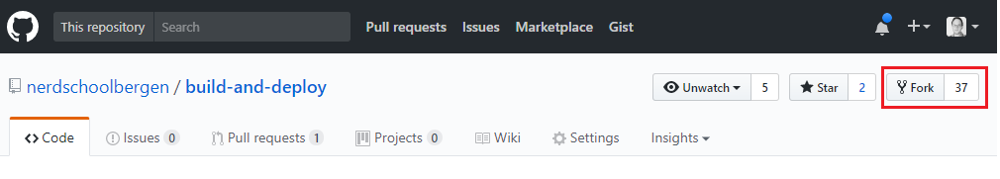
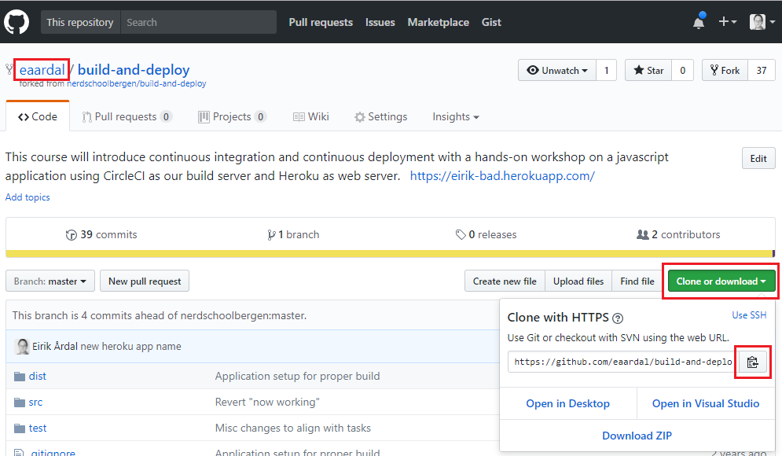

# Exercise 1 - Getting Started

It's that time again. You just finished an awesome new feature which everybody can't wait to get their hands on!
Now you just have to do the 15 manual, repetitive, laborious steps exactly the same way as before, and deliver a 2-page Word document with instructions, together with a zip archive of your build to the IT department so they can deploy the changes.

Or wait. Can't this be automated?

In this workshop we'll look at applications and how we can automate every step from pushing code to your repository to make it available on the production server(s).

Sounds scary?

We'll need to rely on _code quality_ and _automated testing_ to make sure our application meets the standards our users expect. After all, we want to _reduce_ human interference throughout this whole workflow, and we therefore need to make sure the build we push through the pipeline is good enough to be deployed to the users without manual oversight.

We will go through all the steps, from _Continuous Integration_ to _Continuous Deployment_, and then do it ourselves with hands-on exercises using online tools.

The benefits of automating the deployment workflow is many, but chief among them is cost reduction, risk reduction, minimizing risk of human error, and make our life as developers better as we don't have to labor through repetitive tasks.

### In this exercise we will

* _Fork_ and _clone_ our Git repository and get it running on your computer.
* Take a quick tour of the repository and the app (even though the app is _not_ the focus of this workshop - deploying it is).

# 1.1 Getting started

First you need a copy of this Git repository on your computer. You'll also need to _push_ changes to Git in order to trigger builds, but at the moment this repository is owned by the Nerschool GitHub organization so you can read but not touch. To make your own copy of this repository that you'll have full access to, you must _Fork_ this repository.

:pencil2: Make sure you're logged in to GitHub.  
:pencil2: In this Git repository, click the _Fork_ button in the top right corner.

:pencil2: After forking, you should now have a copy of the repository on _your account_. Clone the repository to your computer by opening a terminal and navigate to the folder you want to store your code. Type `git clone {repository url}` to clone it.

:pencil2: Navigate to the repository folder in your terminal and run the following command:

* Install our application's dependencies: `npm install`

> If the command produces an error saying npm is unrecognized, you need to install [NodeJS](https://nodejs.org/en/) first, then restart the terminal window and try again.

:pencil2: Once everything is installed, open the repository using your favorite text editor or IDE.

Let's go through what the folders and files are for:

**Folders**

* The `config` folder contains configuration settings for the app. The only interesting part here is the Webpack config files, which we'll look at in more detail soon.
* The `node_modules` folder is where all dependencies for the app is installed to. This folder was created when you did `npm install`.
* The `public` folder is relevant when we will put our app into production. This is the folder where we'll serve our app from when it's hosted on a webserver.
* The `scripts` folder is just infrastructure created by the scaffolding tool we used to generate this project.
* The `src` folder is where you'll find the app we'll deploy throughout these exercises.

**Files**

* The `.eslintrc.js` file contains configurations for ESLint. We'll go more into detail about this later.

> If you're on mac or linux and can't see `.eslintrc.js` or any other file that starts with a dot (such as `.gitignore`), it's because on nix filesystems, filenames starting with dot indicates that they should be hidden. You need to enable your file explorer to show hidden files if you want to see them when browsing a folder. You can use the `-a` switch to list all files (including hidden ones) in your terminal using `ls`: `ls -a` or `ls -la`.

* The `package-lock.json` file is just for NPM to keep track of our dependencies.
* The `package.json` file is where we keep some info about our app, some _scripts_ like building the app and running tests, and listing our dependencies.

> The project was created using [create-react-app](https://github.com/facebook/create-react-app), a scaffolding tool made for getting started with React apps quickly. It's a great tool if you want to explore making front-end apps using React.

:pencil2: Run `npm start` in your terminal. A browser should open at [http://localhost:3000](http://localhost:3000).  
:pencil2: Click the button and fetch a few movie posters.

# :book: 1.2 The app

Today is about deploying the app and not how it works or building more features, but it's worth having a quick tour nontheless.

As the name implies, the app simply displays movie posters.

Clicking the button below the poster will show another poster.

## 1.2.1 How it works

* It uses the [API](https://developers.themoviedb.org/3) for [The Movie DB](https://www.themoviedb.org/) to fetch movie information. An API key has been registered for this workshop, but please make your own if you want to expand on this in your own project after this workshop.
* On startup we get the first page of the most popular movies (20 movies) from the API.
* Each movie has some details, including a poster url
* We feed each poster url to a component that displays it along with the movie's title and description
* When we click the Next button we feed the next poster url to the component.

> You might need an React plugin for your editor to get syntax highlighting for React (`.jsx`) files. You should install it now if you don't have one.

## 1.2.2 Components

* `PosterCarousel.jsx` is doing the heavy lifting. It's responsible for fetching the movies and send the correct movie to the display component.
  * `componentDidMount` is a special lifecycle method from the React framework which is invoked when the component is initially mounted/started. As you can see, we kick off a few http requests to TheMovieDb here.
  * `render` is another special method from the React framework. It's responsible for returning a new view if any `state` or `props` changes (for example after we call `setState` with new state).
  * While we're fetching data (`isFetchingPopularMovies` is `true`) we show a progress bar.
  * When we're not fetching data we'll render the `PosterCard` component along with a `Button`.
  * If fetching movies failed, we show a simplistic error message.
* `PosterCard.jsx` is responsible for showing the poster and some movie information.

## 1.2.3 Supporting libraries

* The GUI components are from [Material UI](https://material-ui-next.com/)
* Material UI uses [JSS (css-in-js)](http://cssinjs.org/) so we use it too, for simplicity. This is why you'll see styling in the `.jsx` files and not in separate `.css` or `.sass` stylesheets.
* The Material UI guys also made a library of common icons which we use for the "Next"-button icon: [material-ui-icons](https://material.io/icons/)

> If you're interested in learning more about React (later!), we have a complete Nerdschool React workshop [here](https://github.com/nerdschoolbergen/react)

### [Go to exercise 2 :arrow_right:](./exercise_2.md)
