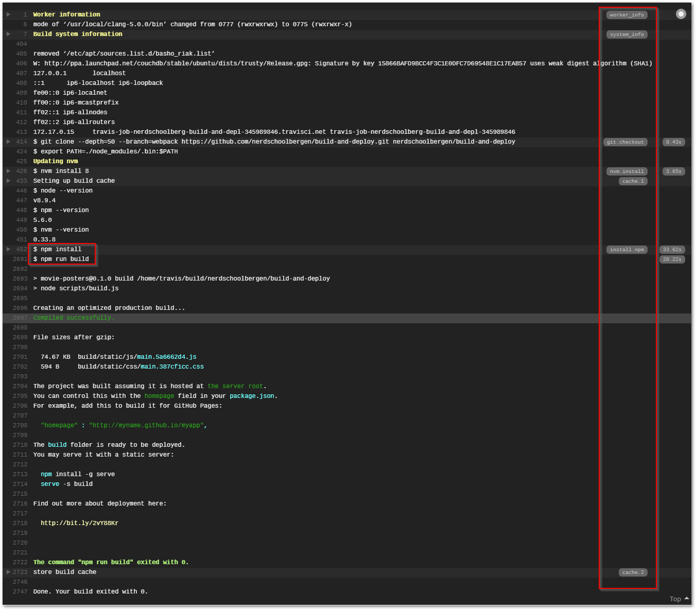

# Exercise 3 - Travis CI

Instead of setting up a build server from scratch, we'll use Travis CI to do all the heavy lifting for us.

As the name implies, this is a service for handling our Continuous Integration steps. We'll have to find another service for hosting our app once we've built and verified it using Travis.

## Travis CI config

Travis is configured through a `.travis.yml` file in our repo.

:pencil2: This file doesn't exist yet so you need to create it.

```yml
language: node_js
node_js:
  - 'stable'
cache:
  directories:
  - node_modules
script: npm run build
```

The file should be named `.travis.yml`, not `travis.yml`.

From top to bottom, this tells TravisCI to:

* Assume our app requires a Node.js environment to build.
* Use the latest stable Node.js release (LTS).
* Cache the `node_modules` directory so we don't have to wait for `npm install` on every build.
* Run the `build` script, which will build our app with production config.

:pencil2: Save and git commit this file. Git push all your changes so far.

## Registering

:pencil2: Head over to [https://travis-ci.org/](https://travis-ci.org/) and sign up using your GitHub account.  
:pencil2: Authorize TravisCI to access your repositories.

## Enabling Travis CI

:pencil2: In the list of projects, flick the switch for the `YOURUSER/build-and-deploy` repository.

A build should be starting immediately on your repository. The build should succeed.

:pencil2: Scroll to the bottom of the build log.

:bulb: Notice that you can see commands being run to the right in the build log. This is helpful for finding config related to our app.



:pencil2: Find the sections for `npm run build`. It should be one of the last events that occurred.

# Improving Continuous Integration

Remember that Continuous Integration is all about making sure our code is good enough to be deployed. So far we're not doing much to prove this. We make sure the app can be built, but that's about it. Let's introduce some more quality checks.

## Linting

Linting is just to verify that our code follows certain best practices and code conventions. We use the tool _ESLint_ to do this for us. We have used this tool in other JavaScript workshops also.

Luckily `create-react-app` also included ESLint along with some rules (the `eslint-*` packages listed under `dependencies` in `package.json`, but it does not run it by default.

> We added the `eslint-config-airbnb` package in addition to the create-react-app defaults. The Airbnb config is by many seen as the defacto standard for modern JavaScript code practices.

> We're also overriding certain rules in the `.eslintrc.js` file because some rules are unnecessarily strict and hard to work with.

:pencil2: Open `package.json` and add `"lint": "eslint src/**/*.js src/**/*.jsx"` under `"scripts"`. This will run eslint on .js and .jsx files.

```
"scripts": {
  ...
  "lint": "eslint src/**/*.js src/**/*.jsx"
},
```

:pencil2: Run `npm run lint` in your terminal. The command should take a few seconds, then exit without errors.  
:pencil2: Open `src/PosterCard.jsx` and comment out line 35 (`classes: PropTypes.object.isRequired,`) and run `lint` again. It should now fail with one error:

```
18:23  error  'classes' is missing in props validation  react/prop-types
```

This is an example of linting helping us enforce good coding practices.

> All modern code editors and IDE's has plugins for ESLint so you get warnings and errors inline in your editor which is very helpful. [Like this](./images/eslint01.png).

:pencil2: Undo the comment and save the file as it was.

## Testing

There is already a script for running our tests in package.json.

:pencil2: Run `npm test` and see that it succeeds. If the terminal says "No changes since last commit" or something similar, press the `a` key to make it run all tests regardless. Press the `q` key to exit. When running this script on our CI, it won't enter this REPL loop or watch mode. It'll just run through all tests once and exit the script.

## Run our CI steps on Travis

Now that we've added more scripts to run, we need to tell Travis about them, and the order in which to run them.

:pencil2: Open `.travis.yml` and change `scripts` to be a list of commands:

```yml
script:
  - npm run lint
  - npm test
  - npm run build
```

Note that in yml files, whitespace/indentation matters. Each list item should be two spaces in.

:pencil2: Commit all changes and push them to git.  
:pencil2: Open Travis again and watch the build succeed.  
:pencil2: Locate the lint and test scripts in the build log and see that they succeeds.


Well done so far :tada:! Next, we'll deploy the app.

### [Go to exercise 4 :arrow_right:](./exercise_4.md)
