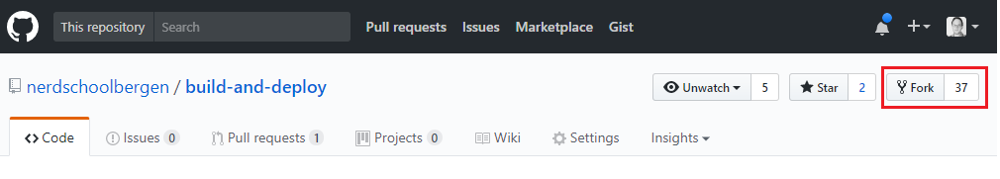
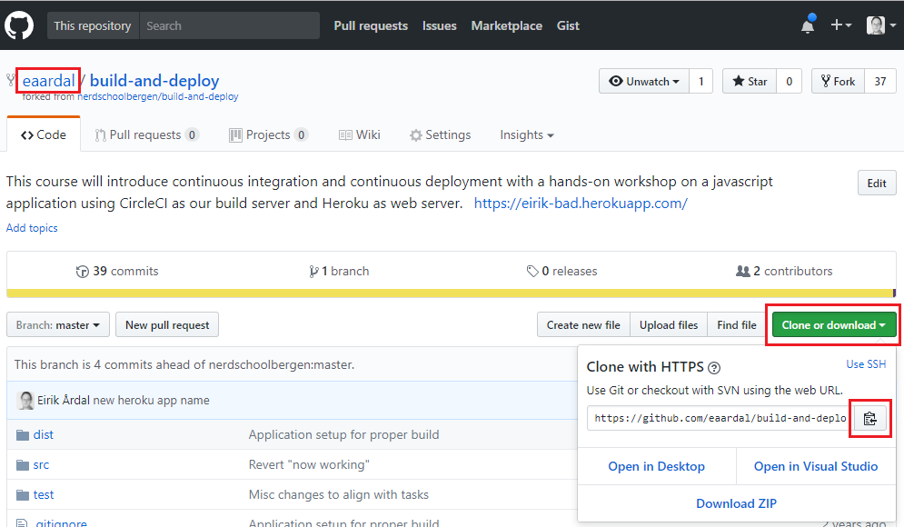
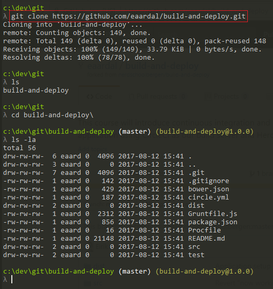

# Exercise 1 - Getting Started

### In this exercise we will

* _Fork_ and _clone_ our Git repository and get it running on your computer.
* Take a quick tour of the repository and the app (even though the app is _not_ the focus of this workshop - deploying it is).

# 1.1 Getting started

First you need a copy of this Git repository on your computer. You'll also need to _push_ changes to Git in order to trigger builds, but you will need your own copy of this repository in order to push any changes. To make your own copy of this repository that you'll have full access to, you must _Fork_ this repository.

:pencil2: Make sure you're logged in to GitHub.  
:pencil2: In this Git repository, click the _Fork_ button in the top right corner.

:pencil2: After forking, you should now have a copy of the repository on _your account_. Clone the repository to your computer by opening a terminal and navigate to the folder you want to store your code. Type `git clone {repository url}` to clone it.

:pencil2: Navigate to the repository folder in your terminal and run the following command:

* Install our application's dependencies: `npm install`

> If the command produces an error saying npm is unrecognized, you need to install [Node.js](https://nodejs.org) first, then restart the terminal window and try again.

:pencil2: Once everything is installed, open the repository in Visual Studio Code.

**Files**

* The `.eslintrc.js` file contains configurations for ESLint. We'll go more into detail about this later.
* The `package-lock.json` file is just for NPM to keep track of our dependencies.
* The `package.json` file is where we keep some info about our app, some _scripts_ like building the app and running tests, and listing our dependencies.

> The project was created using [create-react-app](https://github.com/facebook/create-react-app), a scaffolding tool made for getting started with React apps quickly. It's a great tool if you want to explore making front-end apps using React.

:pencil2: Run `npm start` in your terminal. A browser should open at [http://localhost:3000](http://localhost:3000).  
:pencil2: Click the button and fetch a few movie posters.

# :book: 1.2 The app

Today is about deploying the app and not how it works or building more features, but it's worth having a quick tour nontheless.

As the name implies, the app simply displays movie posters.

Clicking the button below the poster will show another poster.

## 1.2.1 How it works

* It uses the [API](https://developers.themoviedb.org/3) for [The Movie DB](https://www.themoviedb.org/) to fetch movie information. An API key has been registered for this workshop, but please make your own if you want to expand on this in your own project after this workshop.
* On startup we get the first page of the most popular movies (20 movies) from the API.
* Each movie has some details, including a poster url
* We feed each poster url to a component that displays it along with the movie's title and description
* When we click the Next button we feed the next poster url to the component.

> You might need an React plugin for your editor to get syntax highlighting for React (`.jsx`) files. You should install it now if you don't have one.

We will get into further details about the application down the line, when we are ready to perform some changes to it, test that the changes are up to our standards and deploy it to our live environment.

### [Go to exercise 2 :arrow_right:](../exercise-2/README.md)
