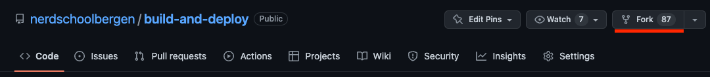
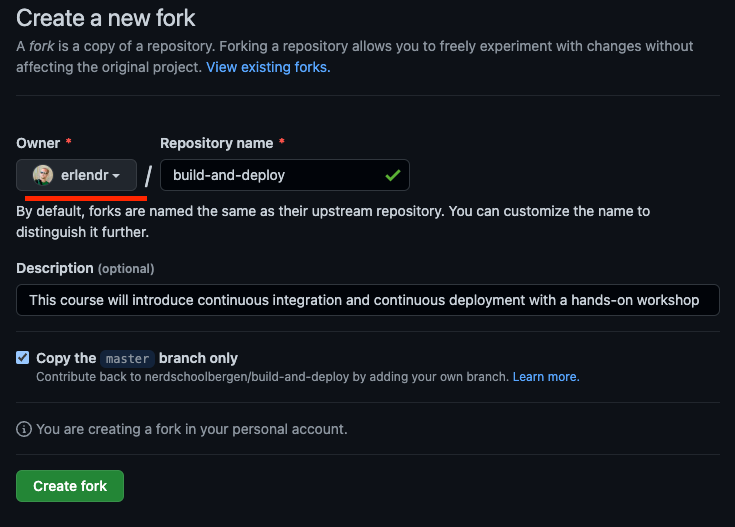
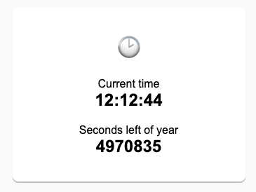

# Exercise 1 - Getting Started

In this exercise you will set up the local development environment required for the next exercises.

You will learn to:

* Install required software
* _Fork_ and _clone_ our Git repository and get it running on your computer.
* Get the local development environment up and running
* Take a quick tour of the repository and the app (even though the app is _not_ the focus of this workshop - deploying it is).

## 1.1 Installing required software

### 1.1.1 Node.js

:book: To see if you already have Node.js installed, open up your terminal application.

* If you're on a Mac, look for a command prompt application called "Terminal".
* If you're on a Windows machine, open the Windows command prompt or "Git Bash".

:book: Once you´ve opened your terminal application, type `node -v`. The output will either tell you which version of Node.js is installed, or it will alert you that Node.js is an unknown command.

:pencil2: If it's an unknown command, download and install the latest LTS (long-term support) release from [nodejs.org](https://nodejs.org/en/).

:exclamation: **Note:** If you have Node installed with a version _less_ than the latest LTS version, please upgrade to the latest LTS version before continuing.

### 1.1.2 Installing Chrome

:pencil2: Install [Google Chrome](https://www.google.com/chrome/browser/desktop/) if you don't have it.

### 1.2 GitHub account setup

:pencil2: If you don't already have a GitHub account, follow the [Sign up for a new GitHub account](https://docs.github.com/en/get-started/signing-up-for-github/signing-up-for-a-new-github-account) guide on GitHub.com. It's free!

:pencil2: Make a note of your GitHub _username_.

### 1.3 Installing git

#### Checking for Git

:pencil2: To see if you already have Git installed, open up your terminal application.

* If you're on a Mac, look for a command prompt application called "Terminal".
* If you're on a Windows machine, open the Windows command prompt or "Git Bash".

Once you've opened your terminal application, type `git version`. The output will either tell you which version of Git is installed, or it will alert you that git is an unknown command. If it's an unknown command, follow the [Install Git](https://github.com/git-guides/install-git) guide.

#### 1.2.2 Optional - Install GitHub Desktop

If you are new to git, [GitHub Desktop](https://desktop.github.com/) is recommended to simplify working with git. GitHub Desktop also installs git automatically.

## 1.2 Getting started

:bulb: The exercises assume that you have prior experience using git. If you are new to git, consider reading the following guides before continuing:

* Git overview: [About Git](https://docs.github.com/en/get-started/using-git/about-git) on GitHub Docs
* [Push commits to a remote](https://docs.github.com/en/get-started/using-git/pushing-commits-to-a-remote-repository) on GitHub Docs
* [Get changes from a remote](https://docs.github.com/en/get-started/using-git/getting-changes-from-a-remote-repository) on GitHub Docs

For more in depth learning, [Git-it](https://github.com/jlord/git-it-electron) is recommended.

:book: Feel free to always ask the instructors for help, as git can be overwhelming for beginners.

### Forking the git repository

:book: A fork is a copy of a repository. Forking a repository allows you to freely experiment with changes without affecting the original project.

:pencil2: Open the [nerdschoolbergen/build-and-deploy](https://github.com/nerdschoolbergen/build-and-deploy) repository page and select _Fork_:


:pencil2: Set _your_ GitHub user as _owner_ and then select _Create fork_:


:book: After forking, you should now have a copy of the repository on _your_ GitHub account.

### Cloning the git repository

:book: Repositories on GitHub are remote repositories. To create a local copy on your computer, you _clone_ the remote repository you just created on your account.

#### Cloning using GitHub Desktop

:book: If you have GitHub Desktop installed, you can use it to clone the repository.

:pencil2: Follow these [instructions](https://docs.github.com/en/repositories/creating-and-managing-repositories/cloning-a-repository?tool=webui).

#### Cloning using a web browser and terminal

:book: If you don't have GitHub Desktop installed, you can clone the repository using the browser and a terminal.

:pencil2: Follow these [instructions](https://docs.github.com/en/repositories/creating-and-managing-repositories/cloning-a-repository?tool=webui).

### Setting up the local app development environment

:book: To make things easier, we have provided a simple example web app for you.

:pencil2: Navigate to the `code` directory in the repository in your terminal and run the following command to install all project dependencies:

```bash
npm install
```

:pencil2: Once everything is installed, open the repository directory in Visual Studio Code.

:book: Let's take a look at the structure of the `code` directory:

```text
code
├── index.html
├── package-lock.json
├── package.json
├── src
│   ├── clock.js
│   ├── clock.test.js
│   ├── main.js
│   └── style.css
```

* The `package-lock.json` file is just for NPM to keep track of our dependencies.
* The `package.json` file is where we keep some metatdata about our app, some _scripts_ like building the app and running tests, and listing our dependencies.

:pencil2: Run `npm start` in your terminal.

:pencil2: Open [http://localhost:5173](http://localhost:5173) in Chrome.

### :book: 1.3 The app

Today is about deploying the app and not how it works or building more features, but it's worth having a quick tour nontheless.

As the name implies, the app simply displays the current time and number of seconds left of the year:



### [Go to exercise 2 :arrow_right:](../exercise-2/README.md)
