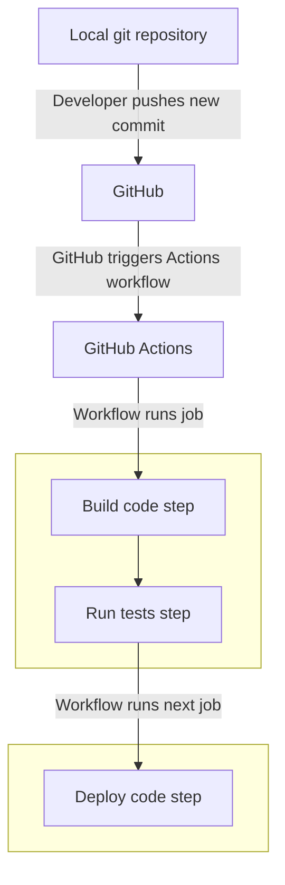
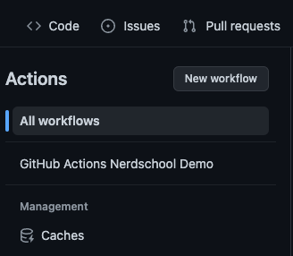
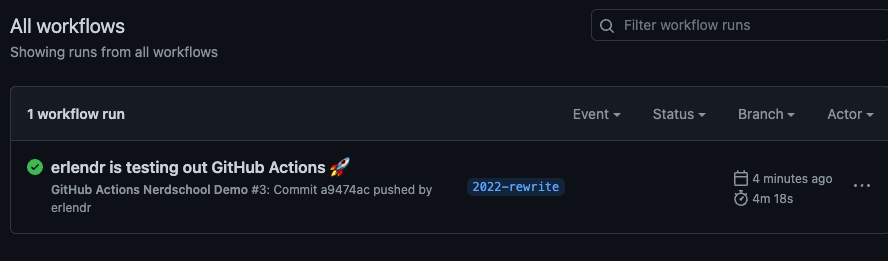
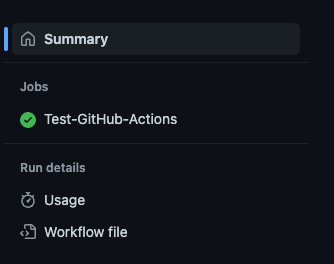
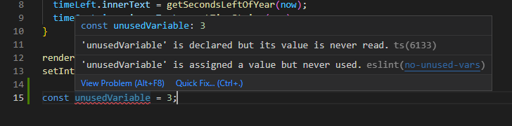
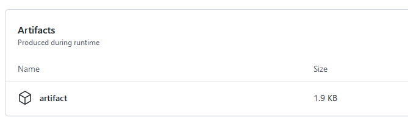

# Exercise 2 - CI/CD pipeline setup

In this exercise you will learn how to set up a CI/CD pipeline for automating tasks using a service called GitHub Actions.

You will learn:

- The basics of GitHub Actions
- Setting up a pipeline
- Automating building the code
- Automate code quality control
- Automate running unit tests

## 2.1 GitHub Actions

:book: Instead of setting up a build server from scratch, we'll use GitHub Actions to do all the heavy lifting for us.

:book: GitHub Actions is a service for handling our Continuous Integration steps. We will use another service for hosting our app once we've built and verified it using GitHub Actions.

Here is an overview of how a CI/CD-pipeline created using GitHub Actions works:



## 2.2 GitHub Actions config

:book: GitHub Actions is "code as configuration", which means that you configure it by simply adding a workflow configuration file to your repository.

:pencil2: Create a new folder at the root of the repository called `.github`

:pencil2: Inside `.github`, create a new folder called `workflows`.

### 2.2.1 GitHub Actions Hello World

:book: Before we start doing anything useful with GitHub Actions, we need to get familiar with the basics of how it works.

:pencil2: Inside the `workflows` folder, create a new file named `test.yml` with the following contents:

```yml
name: GitHub Actions Nerdschool Demo
run-name: ${{ github.actor }} is testing out GitHub Actions 🚀
on: [push]
jobs:
  Test-GitHub-Actions:
    runs-on: ubuntu-latest
    steps:
      - run: echo "🎉 The job was automatically triggered by a ${{ github.event_name }} event."
      - run: echo "🐧 This job is now running on a ${{ runner.os }} server hosted by GitHub!"
      - run: echo "🔎 The name of your branch is ${{ github.ref }} and your repository is ${{ github.repository }}."
      - name: Check out repository code
        uses: actions/checkout@v3
      - run: echo "💡 The ${{ github.repository }} repository has been cloned to the runner."
      - run: echo "🖥️ The workflow is now ready to test your code on the runner."
      - name: List files in the repository
        run: |
          ls ${{ github.workspace }}
      - run: echo "🍏 This job's status is ${{ job.status }}."
```

:pencil2: Save and git commit this file. Git push all your changes so far.

:pencil2: Commiting the workflow file in your repository triggers the `push` event and runs your workflow.

### 2.3 Viewing your workflow results

:pencil2: On GitHub.com, navigate to the main page of your repository.

:pencil2: Under your repository name, click "Actions".


:pencil2: In the left sidebar, click the workflow you want to see (we named it `GitHub Actions Nerdschool Demo`).



:pencil2: From the list of workflow runs, click the name of the run you want to see (`'xxx' is testing out GitHub Actions 🚀`)



:pencil2: Under **Jobs**, click the Test-GitHub-Actions job.



:book: The log shows you how each of the steps was processed. Expand any of the steps to view its details.

:book: The example workflow you just added is triggered each time code is pushed to the branch, and shows you how GitHub Actions can work with the contents of your repository.

:book: Next step is to make GitHub Actions do something more useful!

:exclamation: - If you are not able to see the workflow, try refreshing the page.

### 2.4 Workflow for building our app

:book: The most important step in a CI-pipeline is the _build_ step, where code is built to see if a new commit pushed  _breaks the build_ or not.

:book: We are going to use the following commands inside our new pipeline to build our app:

```bash
npm ci
npm run build
```

- :book: `npm ci` installs all project dependencies. This command is similar to `npm install`, except it's meant to be used in automated environments.
- :book: `npm run build` creates a `dist` (abbriviation for "distribution") directory with a production build of your app.

:bulb: These commands are specific to the app we are building. If you need to build another type of app (Python, .NET, Java, etc.) in your pipeline, you need to use different build tools and commands.

:pencil2: Remove the file `test.yml` we previously created from the `.github\workflows` folder.

:pencil2: Add a new file called `main.yml` in the `.github\workflows` folder with the following contents:

```yml
name: Build

on: [push]

jobs:
  build:

    runs-on: ubuntu-latest
    defaults:
      run:
        working-directory: ./code
    steps:
      - uses: actions/checkout@v3
      - name: Use Node.js 16.x
        uses: actions/setup-node@v3
        with:
          node-version: 16.x
      - run: npm ci
      - run: npm run build
```

Let´s break down what this workflow does:

- `name:` - the name of the workflow
- `on: [push]` - we want to trigger this workflow when commits are _pushed_
- `jobs:` - what jobs we want the workflow to do
  - `build:` - the name of our job
    - `runs-on: ubuntu-latest` - we want to run our workflow on Linux (latest release of Ubuntu)
    - `defaults:` default settings for the job
      - `run:` - settings for running commands
        - `working-directory: ./code` - set working directory for running commands to `./code`, where our app is located
    - `steps:`
      - `- uses: actions/checkout@v3` - git clone the repository
      - `- name: Use Node.js 16.x
        uses: actions/setup-node@v3
        with:
          node-version: 16.x` - install Node.js 16.x
      - `- run: npm ci` - install dependencies
      - `run: npm run build` - build app

:pencil2: Commit all changes and push them to git. The new workflow will now trigger.

:pencil2: Open the GitHub Actions workflow overview and click on the new `Build` workflow on the left side. Click on the workflow run on the right side to see more details.

:book: A workflow run will either succeed or fail, depending on if any of the job steps fail.

:pencil2: Did the workflow run fail :x:?  Try reading the error message and figure out what´s wrong. Ask an instructor if you are stuck.

## 2.5 Improving Continuous Integration

:book: Remember that Continuous Integration is all about making sure our code is good enough to be deployed. So far we're not doing much to prove this. We make sure the app can be built, but that's about it. Let's introduce some more quality checks.

## 2.5.1 Linting

Linting is just to verify that our code follows certain best practices and code conventions. We use the tool _[ESLint](https://eslint.org/)_ to do this for us. ESLint statistically analyzes your code to quickly find problems.

:pencil2: Run `npm run lint` in your terminal to run ESLint. The command should take a few seconds, then exit without errors.

:pencil2: Open `code/src/main.js` and add the following line to the end of the file

```javascript
const unusedVariable = 3;
```

:pencil2: Run `npm run lint` again. 
You should see the following error on the screen
```
error  'unusedVariable' is assigned a value but never used  no-unused-vars
```

This is one of the quality checks we get with linting. We have a unused variable that is not used anywhere and does not provide any value, so the linter will give us feedback that the code is not up to the required standards. 
This is an example of linting helping us enforce good coding practices.

> All modern code editors and IDEs has plugins for ESLint so you get warnings and errors inline in your editor which is very helpful.
 .

:pencil2: To make our CI pipeline automatically lint code, we need to add the following line to `.github/workflows/main.yml`:

```diff
name: Build

on: [push]

jobs:
  build:

    runs-on: ubuntu-latest

    steps:
      - uses: actions/checkout@v3
      - name: Use Node.js 16.x
        uses: actions/setup-node@v3
        with:
          node-version: 16.x
      - run: npm ci
      - run: npm run build
+     - run: npm run lint
```

:pencil2: Git commit this change and push. View the result in the Actions workflow jobs overview on GitHub.com.

:book: The build should fail at this point, because it did not pass our linting step. 

:pencil2: Remove the unused variable that we introduced, and run `npm run lint` again in your terminal to ensure that the code is linted successfully. Push the change to Github and see that the build is successful.

### 2.5.2 Testing

:book: There is already a script for running our unit tests in `package.json`.

:pencil2: Run `npm test` and see that it succeeds. If the terminal says "No tests found related to files changed since last commit" or something similar, press the `a` key to make it run all tests regardless. Press the `q` key to exit. When running this script on our CI, it won't enter this REPL loop or watch mode. It'll just run through all tests once and exit the script.

:pencil2: To run tests automatically in our CI pipeline, we need to add the following line to `.github/workflows/main.yml`:

```diff
name: Build

on: [push]

jobs:
  build:

    runs-on: ubuntu-latest

    steps:
      - uses: actions/checkout@v3
      - name: Use Node.js 16.x
        uses: actions/setup-node@v3
        with:
          node-version: 16.x
      - run: npm ci
      - run: npm run build
      - run: npm run lint
+     - run: npm test
```

:pencil2: Git commit this change and push. View the result in the Actions workflow jobs overview on GitHub.com.

:star: Bonus task: Try messing around with the tests. Can you make them fail? Or even create new tests that are run in our CI pipeline?

## Creating a build artifact

Before we can start deploying anything to the internet, we need something to deploy. So far, we have checked that our code builds and that is passes our quality control checks through linting and testing. 

In order to get an artifact (fancy word for a application that has been built), we can take the output of our build step and store it was a file related to the Github Action workflow that we have just run. 

`npm build` will produce a folder called `dist` in our Github Action Runner. We can take that file and assign it to our workflow and use it in later steps when we are going to deploy the application.

Modify your workflow file to include the `Archive artifacts` step as shown below. 

```diff
name: Build and deploy

on: [push]

jobs:
  build:
    runs-on: ubuntu-latest
    defaults:
      run:
        working-directory: ./code
    steps:
      - uses: actions/checkout@v3
      
      - name: Use Node.js
        uses: actions/setup-node@v3
        with:
          node-version: 16.x
      - run: npm ci
      - run: npm run build
      - run: npm run lint
      - run: npm run test

+     - name: Archive artifacts
+       uses: actions/upload-artifact@v3
+       with:
+         name: artifact
+         path: ./code/dist
```

Commit and push your change to Github, and you chould see the following output on the bottom of your workflow page. This is our application that has been built and is ready to be deployed.

 .
___

Well done so far :tada:! Next, we'll deploy the app.

### [Go to exercise 3 :arrow_right:](../exercise-3/README.md)
