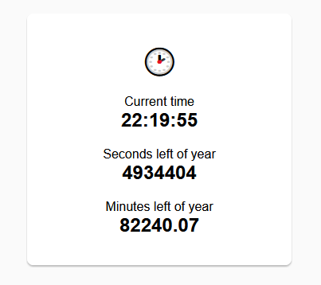

# Exercise 4 - Bonus: Making good use of our build setup

## 4.1 - Deploying changes to our web page
Now we have created a pipeline to build, verify the quality, and deploy our application to the internet. Now we are truly able to deliver features to our users in a quick and safe manner. 

:pencil2: Look at the existing code as inspiration and try to add the number of minutes left of the year with two digit fractional precision. Try to write tests and make sure they pass locally and in your CI pipeline, and that your feature is published to your website. 

## 4.2 - Fixing number formatting in our clock app

Our clock app will display hours, minutes and seconds in a single digit format, if the number is single digit. E.g. `17:04:01` will be rendered as `17:4:1`. Try improving the formatting and write new unit tests to see that they pass.

:book: Things regarding time and dates are difficult to reproduce, so this is a case where unit tests are very useful, where we can provide our own input regardless of what the time actually is.

## Freestyle it - Go your own way

:pencil2: Feel free to freestyle it from now on. Make any change you would like to see live on your page and see it deployed on the internet. 

