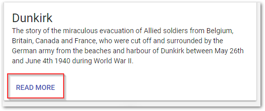
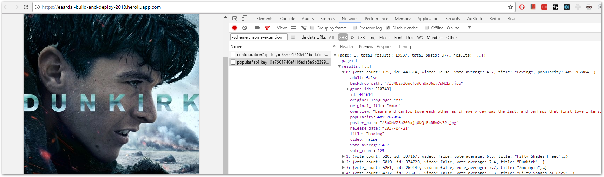

# Exercise 5 - Bonus: Making good use of our build setup

Making the app more interesting is just a matter of using your fantasy. You can get all kinds of info from The Movie Db's API: [https://developers.themoviedb.org/3](https://developers.themoviedb.org/3)

Here are some suggestions to features you can make:

(Remember to git commit your changes and deploy often)

### Implement a 'Read more'-link for each poster



The link should open [The Movie Db's page for the given movie](https://www.themoviedb.org/movie/374720).

* In `PosterCard.jsx`, `import` a `Button` from `@mui/core/Button`, which is the UI library we use.

* The button should be placed inside the `CardActions` element in `PosterCard.jsx`.
* In the button's `href` prop, construct a full url to The Movie Db's page for the given movie. You can use `https://www.themoviedb.org/movie/MOVIE_ID` as the url. The movie ID is available in `movieDetails` (`movieDetails.id`) which is already available inside `PosterCard`.

### Print all movie details to the screen

The `movieDetails` object used in `PosterCard` contains a lot more information you can use, and there are API endpoints to get even more if you want.

* Open the Network tab in Chrome's developer tools (F12) and inspect the returning JSON from the GET request to get the most popular movies.



* In `PosterCard.jsx`, print all of this out to the screen in some pretty way.
* Browse the [Material UI docs](https://material-ui-next.com/demos/cards/) and find some suitable way to present it all.

### List all posters in a grid

This one is slightly more advanced...

* Make a copy of `PosterCarousel.jsx` and name it something more fitting like `PosterGrid.jsx` or `PosterList.jsx` or just `Posters.jsx`.
* You basically want to keep the logic for fetching the API configuration and the most popular movies, but change the `render` method to return a list of `PosterCard` components.
  * In React you can render a list of stuff like this:

```js
{movies.map(movie => (
  <PosterCard posterUrl={constructPosterUrl(movie.poster_path)} ...
))}
```

* Remove the logic and GUI for showing the next poster.
* Probably select a smaller poster size (in `constructPosterUrl`) so you can fit more on the screen.
